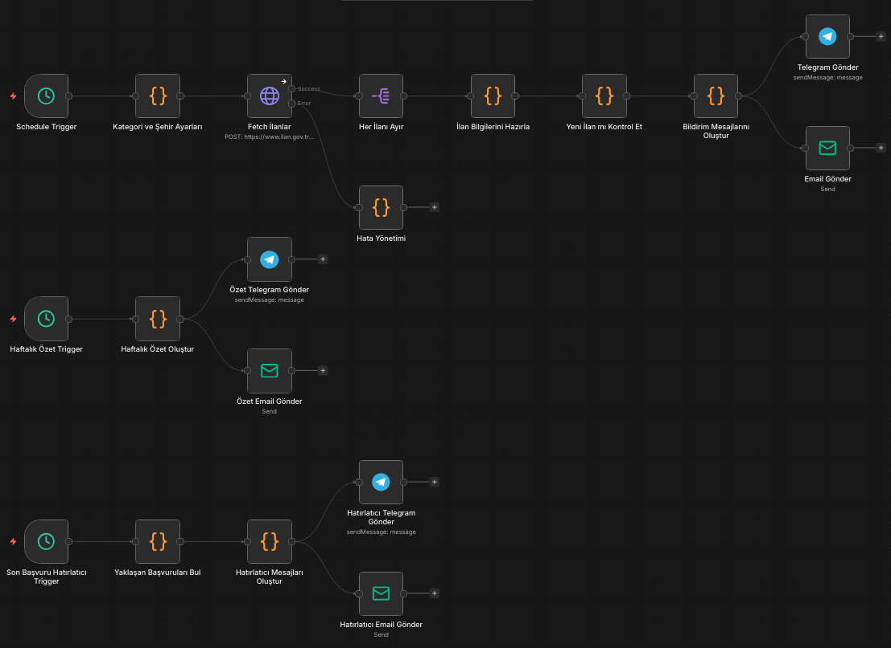

# ilan.gov.tr — Akademik İş İlanı Takip Workflow'u

[](https://n8n.io/)
[](https://telegram.org/)
[](#)
[](LICENSE)

[ilan.gov.tr](https://www.ilan.gov.tr/) üzerinde yayımlanan **akademik personel ilanlarını** (Araştırma Görevlisi, Öğretim Görevlisi, Uzman) otomatik olarak takip eden ve yeni ilanları **Telegram** ve **Email** ile bildiren bir n8n workflow'u.

---

## Özellikler

- **Saatlik Otomatik Kontrol** — Her saat API'ye sorgu atar
- **Çift Kanal Bildirim** — Telegram + Email (SMTP) eşzamanlı bildirim
- **Çoklu Kategori Takibi** — Araştırma Gör., Öğretim Üyesi ve tüm akademik ilanlar aynı anda
- **Şehir Bazlı Filtreleme** — Plaka koduyla istediğiniz şehirleri takip edin
- **Haftalık Özet Raporu** — Her Pazartesi şehir ve kurum bazlı istatistikler
- **Akıllı Deduplication** — Aynı ilanı tekrar bildirmez (Workflow Static Data)
- **Hata Yönetimi** — API hatalarını yakalar, workflow çökmez
- **50 İlan Kapasitesi** — Yoğun dönemlerde bile ilan kaçırmaz
- **Otomatik Cache Temizliği** — 500 ilan sonrası eski kayıtları siler
- **Zengin Mesaj Formatı** — HTML formatlı Telegram mesajları ve stilli email'ler

---

## Workflow Mimarisi

Workflow iki bağımsız akıştan oluşur:




**14 node** • 6 Code • 1 HTTP Request • 2 Telegram • 2 Email • 2 Trigger • 1 Error Handler

---

## Kurulum

### Gereksinimler

- [n8n](https://n8n.io/) (self-hosted veya n8n Cloud)
- Telegram Bot Token ([BotFather](https://t.me/BotFather) ile oluşturun)
- SMTP hesabı (Gmail, Outlook, vb.)

### Adım 1: Workflow'u Import Edin

**Yöntem A — URL ile (önerilen):**
1. n8n editörünü açın
2. Sağ üstteki **⋯** menüsünden **Import from URL** seçin
3. Aşağıdaki URL'yi yapıştırın:
   ```
   https://raw.githubusercontent.com/cagatayuresin/n8n-ilan-gov-tr-akademik-is-ilani-takip/main/workflow.json
   ```

**Yöntem B — Dosya ile:**
1. Bu repo'yu klonlayın veya `workflow.json` dosyasını indirin
2. n8n editöründe **⋯ → Import from File** seçin
3. `workflow.json` dosyasını yükleyin

### Adım 2: Credential'ları Ayarlayın

#### Telegram Bot

1. [BotFather](https://t.me/BotFather)'dan yeni bir bot oluşturun
2. Bot token'ını alın
3. n8n'de **Settings → Credentials → New → Telegram API** ekleyin
4. Token'ı yapıştırın
5. **Telegram Gönder** node'unda:
   - Credential'ı seçin
   - `YOUR_CHAT_ID` yerine hedef grup/kanal ID'nizi yazın

> Chat ID'nizi bulmak için botu gruba ekleyip [@userinfobot](https://t.me/userinfobot) kullanabilirsiniz.

#### SMTP Email

1. n8n'de **Settings → Credentials → New → SMTP** ekleyin
2. SMTP bilgilerinizi girin:
   - Host: `smtp.gmail.com` (Gmail için)
   - Port: `465` (SSL) veya `587` (TLS)
   - Kullanıcı: Email adresiniz
   - Şifre: [App Password](https://myaccount.google.com/apppasswords) (Gmail için)
3. **Email Gönder** node'unda:
   - Credential'ı seçin
   - `YOUR_SMTP_FROM_EMAIL` yerine gönderici email'i yazın
   - `YOUR_NOTIFY_EMAIL_TO` yerine alıcı email'i yazın

### Adım 3: Aktifleştirin

Workflow'u **Active** duruma getirin. Her saat yeni ilanlar kontrol edilecek.

---

## Konfigürasyon

Tüm ayarlar **"Kategori ve Şehir Ayarları"** node'unda tek bir yerden yapılır:

```javascript
const CONFIG = {
  // Birden fazla kategori takip edilebilir
  categories: [693, 672],

  // Şehir filtresi (boş = tüm şehirler)
  cities: [],

  // Sayfa başına maksimum ilan
  maxResults: 50
};
```

### Kategori ID'leri

| txv Değeri | Kategori | Açıklama |
|:----------:|----------|----------|
| `693` | Araştırma Gör. & Öğretim Gör. & Uzman | **Varsayılan** |
| `672` | Öğretim Üyesi Alımları | Prof., Doç., Dr. Öğr. Üyesi |
| `73` | Tüm Akademik Personel | Tüm kategoriler dahil |

> Birden fazla kategori ekleyebilirsiniz: `categories: [693, 672]` — her biri için ayrı API isteği yapılır.

### Şehir Filtresi

Sadece belirli şehirlerdeki ilanları takip etmek için plaka kodlarını ekleyin:

```javascript
cities: [34, 6, 35]  // İstanbul, Ankara, İzmir
```

| Plaka | Şehir | Plaka | Şehir | Plaka | Şehir |
|:-----:|-------|:-----:|-------|:-----:|-------|
| `6` | Ankara | `34` | İstanbul | `35` | İzmir |
| `16` | Bursa | `42` | Konya | `1` | Adana |
| `7` | Antalya | `27` | Gaziantep | `55` | Samsun |

Boş bırakılırsa (`cities: []`) tüm şehirler takip edilir.

### Kontrol Sıklığı

**Schedule Trigger** node'unda interval ayarını değiştirebilirsiniz:
- `hours` → Her saat (varsayılan)
- `minutes` + `value: 30` → Her 30 dakika

### Haftalık Özet

**Haftalık Özet Trigger** her Pazartesi saat 09:00'da çalışır. Cron ifadesini değiştirerek zamanlamayı ayarlayabilirsiniz:
- `0 9 * * 1` → Pazartesi 09:00 (varsayılan)
- `0 9 * * 5` → Cuma 09:00
- `0 18 * * 0` → Pazar 18:00

---

## API Referansı

Bu workflow [ilan.gov.tr](https://www.ilan.gov.tr/) API'sini kullanır:

**Endpoint:** `POST https://www.ilan.gov.tr/api/api/services/app/Ad/AdsByFilter`

**Request Body:**
```json
{
  "keys": {
    "txv": [693],
    "currentPage": [1]
  },
  "sorting": "publish_time desc",
  "skipCount": 0,
  "maxResultCount": 50
}
```

**Kullanılabilir Filtreler:**

| Parametre | Açıklama | Örnek |
|-----------|----------|-------|
| `txv` | Kategori ID | `[693]`, `[672]`, `[73]` |
| `cty` | Şehir (plaka kodu) | `[34]` (İstanbul), `[6]` (Ankara) |
| `currentPage` | Sayfa numarası | `[1]` |
| `skipCount` | Atlanacak ilan sayısı | `0`, `10`, `20` |
| `maxResultCount` | Sayfa başına ilan | `10`, `50` |
| `sorting` | Sıralama | `"publish_time desc"` |

---

## Bildirim Örnekleri

### Yeni İlan Bildirimi (Telegram)
```
🎓 YENİ AKADEMİK İLAN

📋 İlan No: YOK850001
🏛️ Kurum: ÖRNEK ÜNİVERSİTESİ REKTÖRLÜĞÜ
📌 Başlık: Araştırma Görevlisi Alım İlanı
📍 Şehir: ANKARA
📅 Yayın Tarihi: 25.03.2026
📰 Kaynak: Yüksek Öğretim Kurumu

🔗 İlanı Görüntüle
```

### Haftalık Özet (Telegram)
```
📊 HAFTALIK AKADEMİK İLAN ÖZETİ
📅 19.03.2026 — 26.03.2026

📈 Toplam Yeni İlan: 14

🏙️ Şehirlere Göre:
  • İSTANBUL: 6 ilan
  • ANKARA: 4 ilan
  • İZMİR: 2 ilan

🏛️ Kurumlara Göre (İlk 10):
  • İSTANBUL ÜNİVERSİTESİ: 3 ilan
  • ANKARA ÜNİVERSİTESİ: 2 ilan
```

### Email
Şık, gradient header'lı HTML email ile tablo formatında ilan bilgileri ve tek tıkla ilan sayfasına git butonu. Haftalık özet email'i ise yeşil gradient ile şehir/kurum istatistik tabloları içerir.

---

## Katkıda Bulunma

Katkılarınızı memnuniyetle karşılıyoruz!

1. Bu repo'yu fork edin
2. Yeni bir branch oluşturun (`git checkout -b feature/yeni-ozellik`)
3. Değişikliklerinizi commit edin (`git commit -m 'Yeni özellik: ...'`)
4. Branch'inizi push edin (`git push origin feature/yeni-ozellik`)
5. Pull Request açın

### Geliştirme Fikirleri

- [ ] Discord webhook desteği
- [ ] Anahtar kelime bazlı filtreleme
- [ ] Başvuru bitiş tarihi uyarısı

---

## Lisans

Bu proje [MIT Lisansı](LICENSE) ile lisanslanmıştır.

---

<p align="center">
  <sub>
    ilan.gov.tr ile resmi bir bağlantısı yoktur. Açık veri API'si kullanılmaktadır.
  </sub>
</p>
